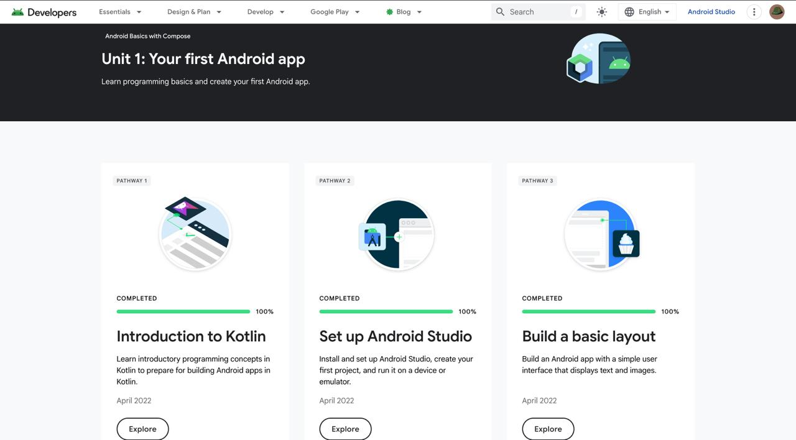
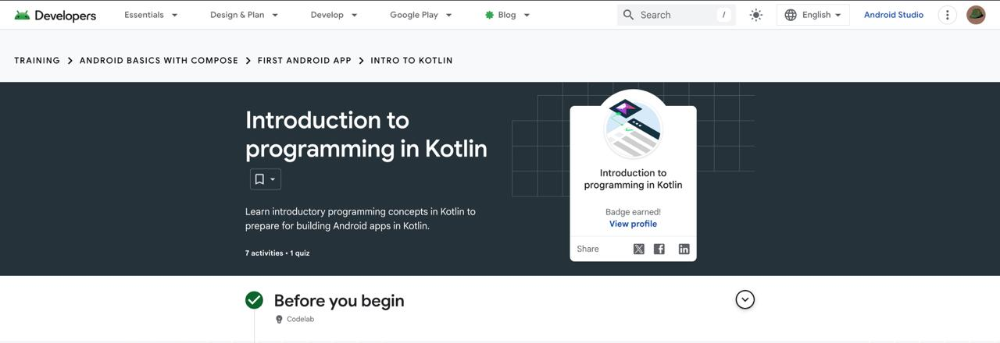
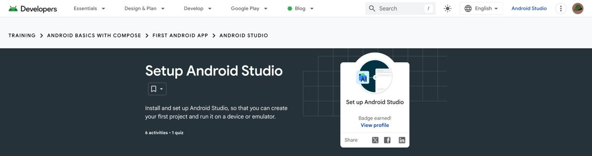
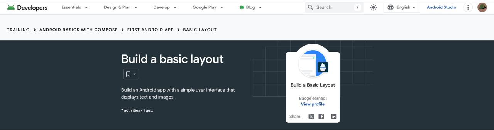

# Module 1 - Android Basics

> Android Basics with Compose, Unit 1: Your first Android app

[Portfolio home](../README.md) | [Analysis](Analysis.md) | [Badge evidence](Badge-Evidence/) | [Screenshots](Screenshots/) | [Source code](Source-Code/)

## Module Overview

This unit introduces Kotlin programming foundations, Android Studio setup, and the first basic Android layout activities.

## Pathway Completion

| Pathway | Evidence |
|---|---|
| Introduction to programming in Kotlin | [Badge screenshot](Badge-Evidence/introduction-to-programming-in-kotlin.jpeg) |
| Set up Android Studio | [Badge screenshot](Badge-Evidence/set-up-android-studio.jpeg) |
| Build a Basic Layout | [Badge screenshot](Badge-Evidence/build-a-basic-layout.jpeg) |

The [Unit 1 overview screenshot](Screenshots/unit-1-overview.jpeg) shows the unit-level learning page.

## Evidence Gallery

| Unit overview | Kotlin introduction | Android Studio setup | Basic layout |
|---|---|---|---|
|  |  |  |  |

## App Output

## Learning Outcomes To Discuss

- Kotlin program structure, functions, and variables.
- Android Studio installation and project setup.
- Activity entry point and basic Compose UI.
- Layout composition with text, images, and modifiers.

## Reviewer Checklist

- [x] Unit overview screenshot
- [x] Three badge screenshots
- [x] App-output screenshot
- [ ] Completed source code added by student
- [ ] Student-authored technical analysis
