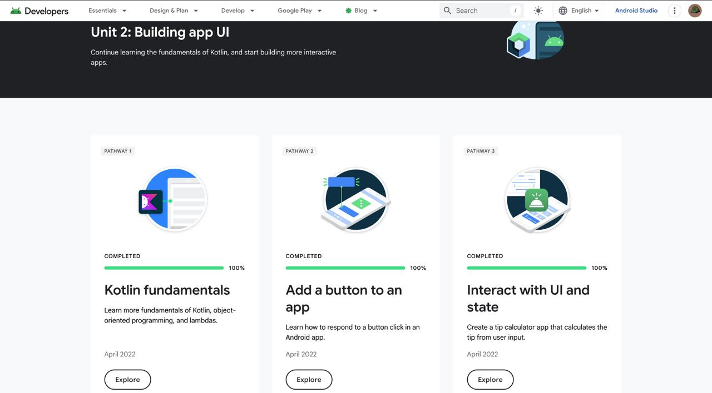
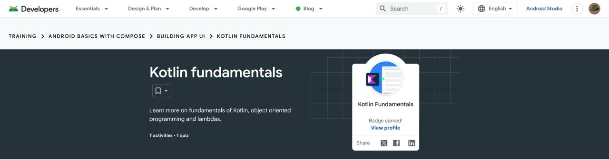
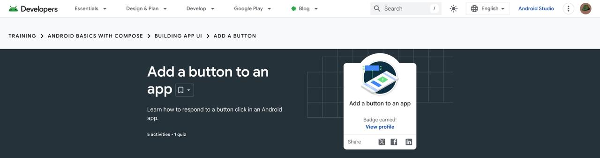
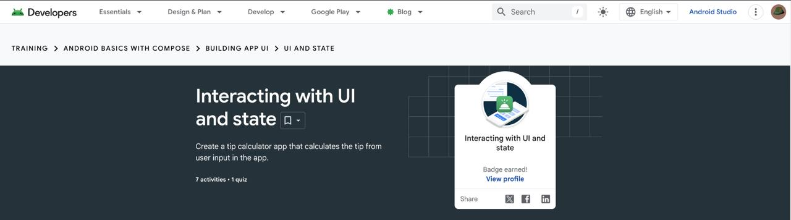

# Module 2 - Jetpack Compose

> Android Basics with Compose, Unit 2: Building app UI

[Portfolio home](../README.md) | [Analysis](Analysis.md) | [Badge evidence](Badge-Evidence/) | [Screenshots](Screenshots/) | [Source code](Source-Code/)

## Module Overview

This unit develops interactive Compose user interfaces using Kotlin fundamentals, button events, UI state, and recomposition.

## Pathway Completion

| Pathway | Evidence |
|---|---|
| Kotlin fundamentals | [Badge screenshot](Badge-Evidence/kotlin-fundamentals.jpeg) |
| Add a button to an app | [Badge screenshot](Badge-Evidence/add-a-button-to-an-app.jpeg) |
| Interacting with UI and state | [Badge screenshot](Badge-Evidence/interacting-with-ui-and-state.jpeg) |

The [Unit 2 overview screenshot](Screenshots/unit-2-overview.jpeg) shows the unit-level learning page.

## Evidence Gallery

| Unit overview | Kotlin fundamentals | Add a button | UI and state |
|---|---|---|---|
|  |  |  |  |

## Learning Outcomes To Discuss

- Compose state and recomposition.
- Button click events and user interaction.
- Separating calculation logic from UI code.
- Testing simple Kotlin functions and UI behavior.

## Reviewer Checklist

- [x] Unit overview screenshot
- [x] Three badge screenshots
- [ ] Completed source code added by student
- [ ] Student-authored technical analysis

