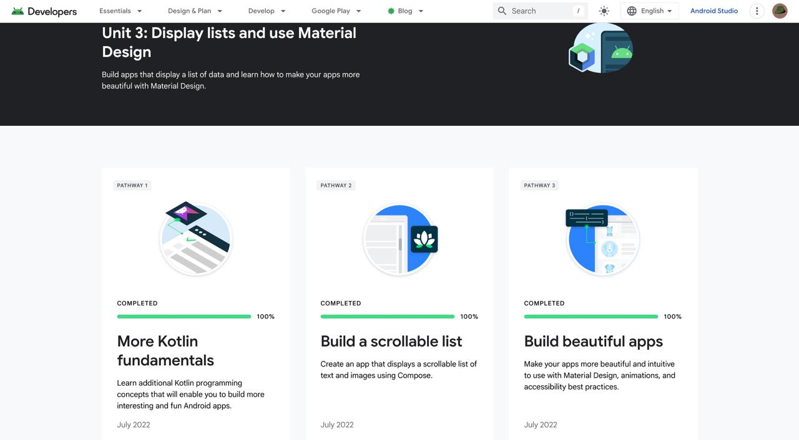
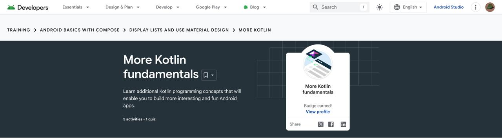
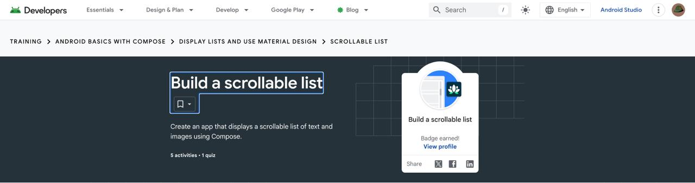
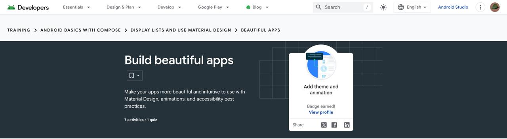
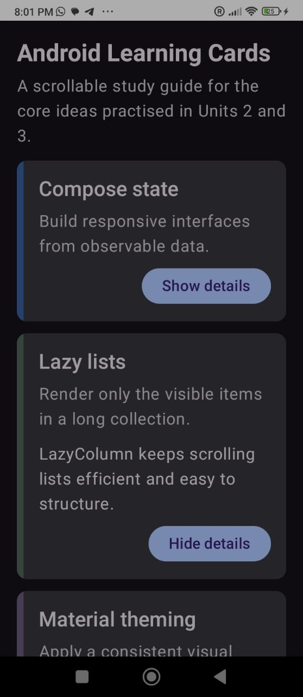
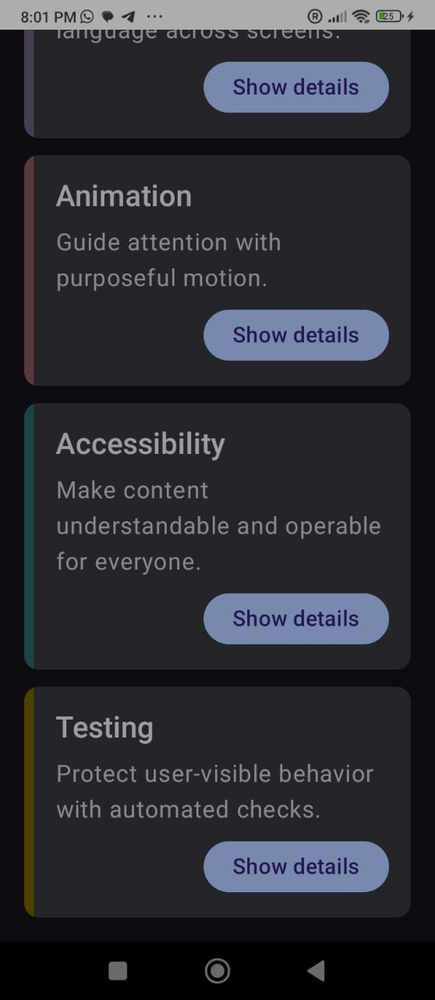

# Module 3 - Lists and Material Design

> Android Basics with Compose, Unit 3: Display lists and use Material Design

[Portfolio home](../README.md) | [Analysis](Analysis.md) | [Badge evidence](Badge-Evidence/) | [Screenshots](Screenshots/) | [Source code](Source-Code/)

## Module Overview

This unit expands Android UI work with Kotlin collections, scrollable lists, Material Design, theming, and more polished app presentation.

## Pathway Completion

| Pathway | Evidence |
|---|---|
| More Kotlin fundamentals | [Badge screenshot](Badge-Evidence/more-kotlin-fundamentals.jpeg) |
| Build a scrollable list | [Badge screenshot](Badge-Evidence/build-a-scrollable-list.jpeg) |
| Build beautiful apps | [Badge screenshot](Badge-Evidence/build-beautiful-apps.jpeg) |

The [Unit 3 overview screenshot](Screenshots/unit-3-overview.jpeg) shows the unit-level learning page.

## Evidence Gallery

| Unit overview | Kotlin fundamentals | Scrollable list | Beautiful apps |
|---|---|---|---|
|  |  |  |  |

## App Output

| Learning cards list | Learning cards details |
|---|---|
|  |  |

## Learning Outcomes To Discuss

- Lists, collections, and reusable data models.
- `LazyColumn` and efficient scrollable UI.
- Material Design styling, colors, and typography.
- Accessibility and consistency in UI design.

## Reviewer Checklist

- [x] Unit overview screenshot
- [x] Three badge screenshots
- [x] App-output screenshots
- [ ] Completed source code added by student
- [ ] Student-authored technical analysis
