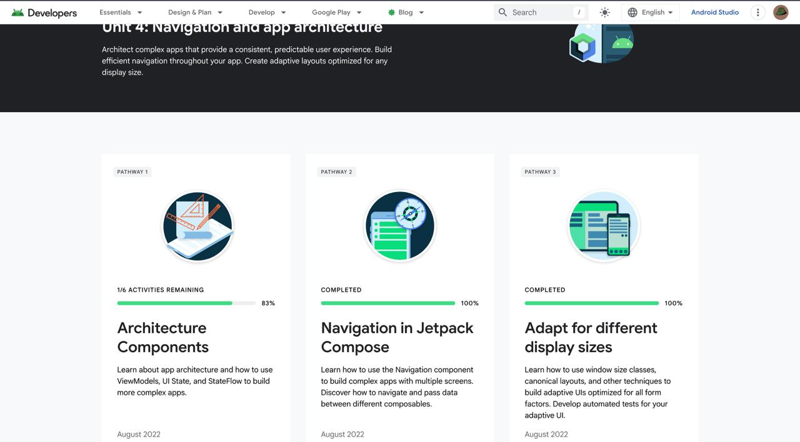
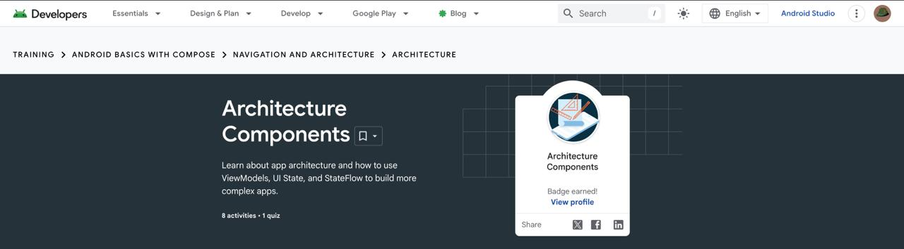
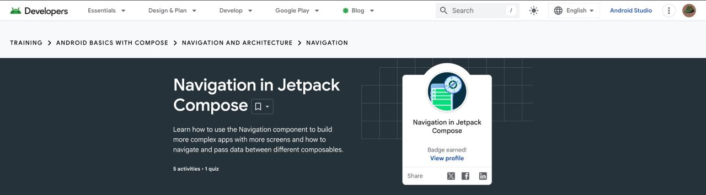
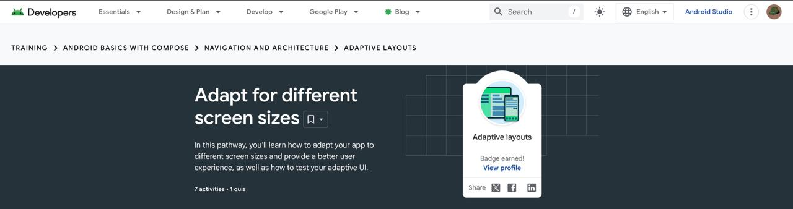
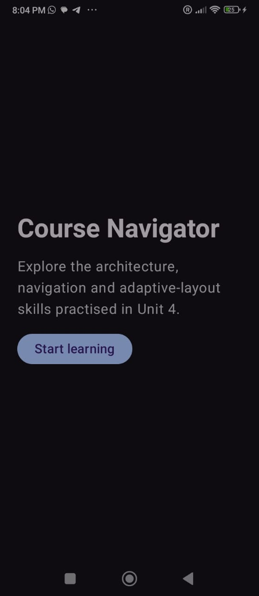
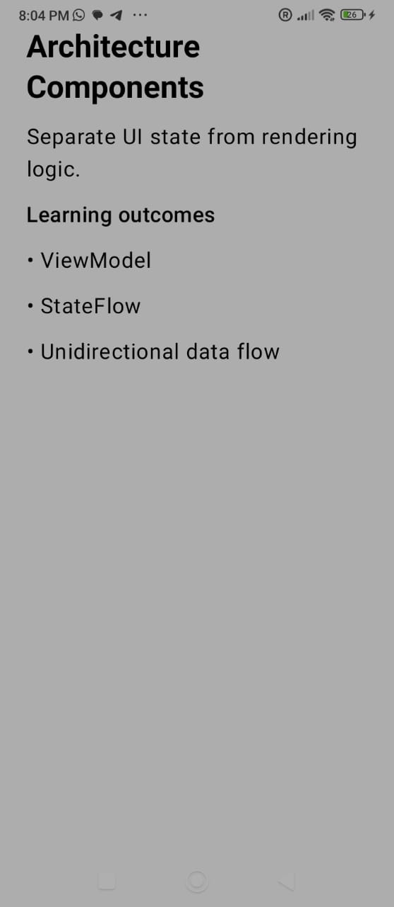
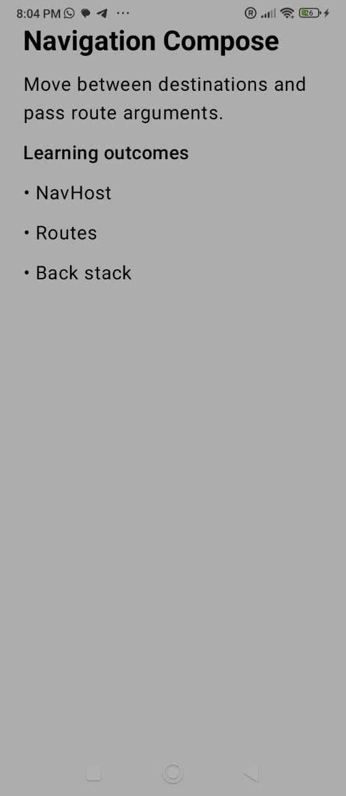
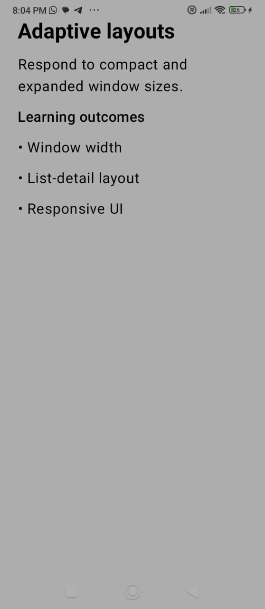

# Module 4 - Navigation and App Architecture

> Android Basics with Compose, Unit 4: Navigation and app architecture

[Portfolio home](../README.md) | [Analysis](Analysis.md) | [Badge evidence](Badge-Evidence/) | [Screenshots](Screenshots/) | [Source code](Source-Code/)

## Module Overview

This unit introduces architecture components, app navigation, and adaptive layouts for different screen sizes.

## Pathway Completion

| Pathway | Evidence |
|---|---|
| Architecture Components | [Badge screenshot](Badge-Evidence/architecture-components.jpeg) |
| Navigation in Jetpack Compose | [Badge screenshot](Badge-Evidence/navigation-in-jetpack-compose.jpeg) |
| Adaptive layouts | [Badge screenshot](Badge-Evidence/adaptive-layouts.jpeg) |

The [Unit 4 overview screenshot](Screenshots/unit-4-overview.jpeg) shows the unit-level learning page.

## Evidence Gallery

| Unit overview | Architecture | Navigation | Adaptive layouts |
|---|---|---|---|
|  |  |  |  |

## App Output

| Course navigator home | Architecture | Navigation | Adaptive layouts |
|---|---|---|---|
|  |  |  |  |

## Learning Outcomes To Discuss

- Separating UI from state and app logic.
- Navigation routes and screen transitions.
- ViewModel and state ownership.
- Adaptive layout decisions for different devices.

## Reviewer Checklist

- [x] Unit overview screenshot
- [x] Three badge screenshots
- [x] App-output screenshots
- [ ] Completed source code added by student
- [ ] Student-authored technical analysis
